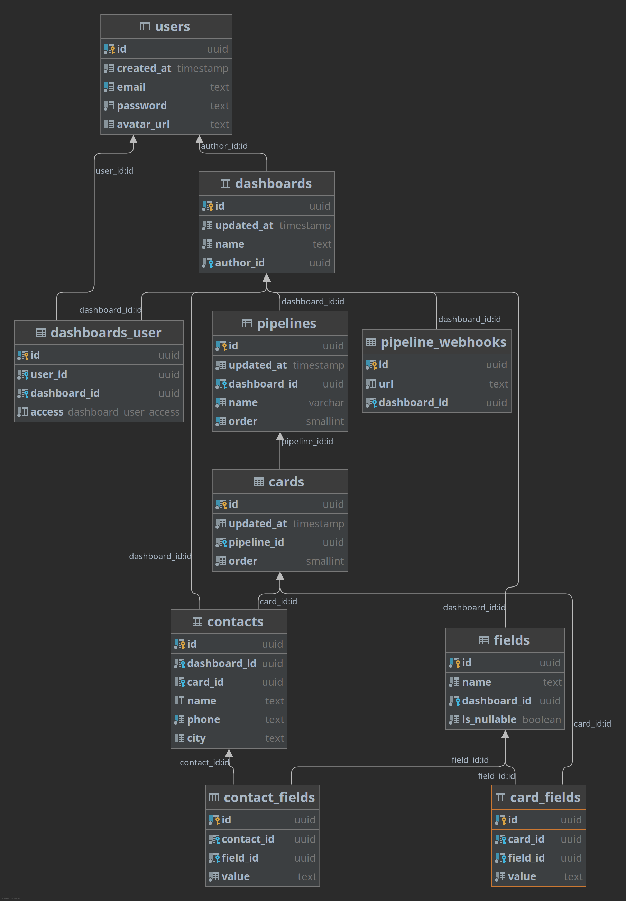

# Unnamed CRM


### How to start:

#### Local development

First start:
```bash
$ chmod +x ./.local/run  
$ ./.local/run
```
or do it yourself / the bottom line is that you need to create a subnet in docker
for example:
```bash
$ docker network create ucrm --subnet 172.4.4.0/24
$ docker-compose up --build
```

subsequent runs can simply be
```bash
$ docker-compose up --build
```

##### Migrations :
```bash
$ export DATABASE_NAME=<database_name>
$ export DATABASE_USER=<database_user>
$ chmod +x ./.local/migrations
$ ./.local/migrations 
```
## Database scheme

